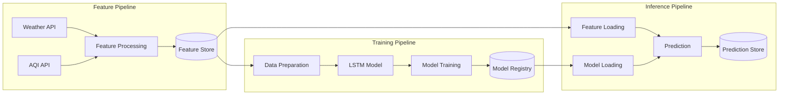

# AQI Prediction System

A learning project to build a simple yet complete ML system for predicting Air Quality Index (AQI) values. This project demonstrates the implementation of modern ML system components using a simple file-based infrastructure.

## Project Overview

This project was developed as a personal learning exercise to understand the key components of a production ML system. It was built with extensive use of AI assistance through the Windsurf IDE, which provided intelligent code generation and debugging capabilities.

### Architecture

The system is composed of three main pipelines:



### Key Components

- **Feature Pipeline**: Collects and processes weather and AQI data
- **Training Pipeline**: Prepares data and trains an LSTM model
- **Inference Pipeline**: Generates predictions using the trained model
- **Infrastructure**:
  - Feature Store: Stores processed features
  - Model Registry: Manages model versions and metadata
  - Prediction Store: Records model predictions and metadata

## Technical Details

### ML Infrastructure
The project uses a simple file-based approach for ML system components:
- JSON files for storing predictions and model metadata
- JSON files for feature storage
- PyTorch model checkpoints for model storage

### Key Technologies
- **PyTorch**: Deep learning framework for LSTM implementation
- **Pandas**: Data manipulation and storage
- **Scikit-learn**: Data preprocessing
- **Pytest**: Comprehensive testing suite

## Getting Started

1. Create a virtual environment:
```bash
python -m venv .venv
source .venv/bin/activate  # On Unix/macOS
```

2. Install uv:
```bash
curl -LsSf https://astral.sh/uv/install.sh | sh
```

3. Install dependencies:
```bash
uv sync
```

4. Set up environment variables:
```bash
cp .env.example .env
# Edit .env with your AQI API key
```

5. Run tests:
```bash
uv run pytest tests/
```

## Project Structure
```markdown
aqi-prediction/
├── feature_pipeline.py    # Feature collection and processing
├── training_pipeline.py   # Model training and evaluation
├── inference_pipeline.py  # Prediction generation
├── infra/                 # Infrastructure components
│   ├── feature_store.py
│   ├── model_registry.py
│   └── prediction_store.py
└── tests/                 # Comprehensive test suite
